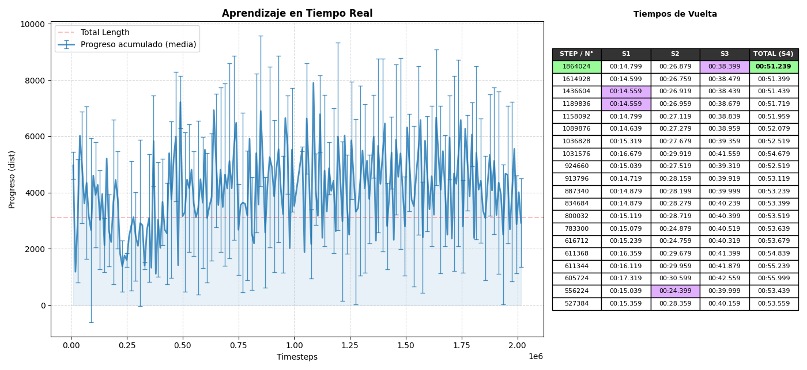
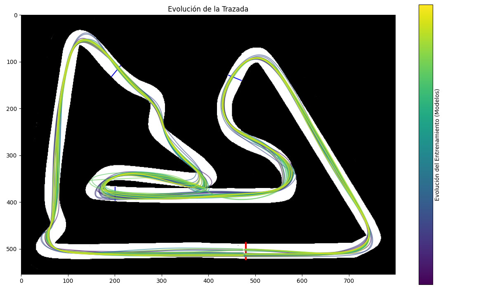
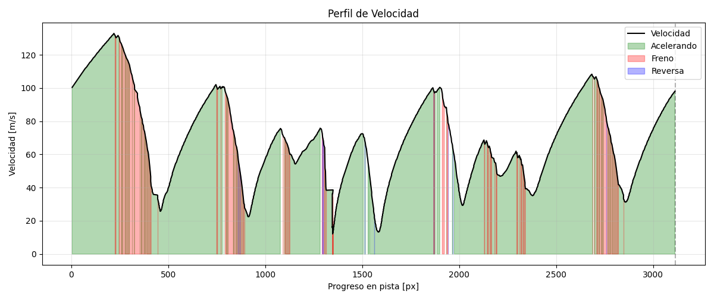

# RL-Race: Proximal Policy Optimization (PPO)

Este proyecto desarrolla un agente de **Aprendizaje por Refuerzo (RL)** capaz de manejar y mejorar los tiempos de vuelta en un juego de carreras simple con controles binarios. Situado en el circuito de baréin. Utilizando un entorno construido en **Pygame**, el agente aprende a optimizar trazadas y velocidades mediante interacción directa con el entorno.

El núcleo del simulador está basado en la lógica de [Juego-Carrera](https://github.com/fausto-bottazzini/Juego-Carrera), adaptado como un entorno de entrenamiento compatible con interfaces de RL.

---

## Características del Proyecto

* **Motor de Física Propio:** Cálculos vectoriales para aceleración y fricción.
* **Sensores de Ray-Casting y SDF:** El agente percibe su entorno mediante 9 "rayos" que miden la distancia a los límites de la pista en tiempo real y otros 7 valores, entre ellos el valor del SDF del circuito.
* **Espacio de Acciones Discreto** El agente actua mediante 5 controles binarios, simulando la entrada de un teclado.
* **Algoritmo PPO:** Implementación con **Stable Baselines3** para el manejo de espacios de acciones continuos.
* **Telemetría de Datos:** Integración con **Matplotlib** para el análisis de rendimiento durante y despues del entrenamiento.

---
## Circuito y Auto
El circuito se encuentra en binario para poder manejar la logica de fuera de pista. Se calculó una centerline a partír de un Signed Distance Field (SDF), parametrizada de forma continua, para poder calcular el progreso en fomra de arco.

El auto cuenta con una velocidad punta, tanto hacia adelante como en reversa. Al igual que en el juego es un punto. Existe un drag constante y una fuerte resistencia fuera de pista y para las velocidades laterales (limitando el drift)


## Entrenamiento
El entrenamiento se llevó a cabo de forma paralela en varios nucleos de un procesador.
### Función de Recompensa (Reward Function)
El éxito del agente se define mediante una función de recompensa densa:

Para un primer entrenamiento donde el agente aprende a manejarse en el entorno:
1.  **Progreso (+):** Premio por avanzar en pista alineado, respecto de la centerline. 
2. **SDF (+):** Valor del SDF como premio o castigo (dentro/fuera), solo si avanza. 
3.  **Vuelta (+):** Gran premio por completar una vuelta.
4.  **Castigos varios (-):** Pequeños castigos por no avanzar, accionar botones opuestos, dar vueltas en circulos.
5.  **Penalización por Fuera de Pista (-):** Penalización por estar fuera de pista, y fin del intento y castigo si no regresa paasados 2 segundos.

En el segundo entrenamiento (optimización) se da mas libertad en la forma de manejar, pero se premia hacer de forma rápida la vuelta. Ademas se agregan los sectores. 
1. **Progreso (+):** Avanzar en pista, al igual que en el primer entrenamiento.
2. **Sectores (+):** Completar sectores en orden, saltearselos o no hacerlos en orden resetea el intento y aplica un castigo severo. 
3. **Vuelta Rápida (++):** Premio principal, cuanto mas rápida mayor. Se dejan hacer hasta 3 vueltas seguidas (lanzada). 
4. **Castigos varios (-):** No avanzar y accionar botones opuestos. 
5. **Fuera de pista (-):** Mismo funcionamiento que en el primer entrenamietno. 
 
### Observaciones
El vector de estado que recibe el modelo incluye:
* Velocidad actual del vehículo, en la dirección de movimiento y en la perpendicular.
* Alineación con la centerline (El circuito).
* Dirección en la que se encuentra un punto futuro del circuito (calculado con la centerline), como coseno y seno.
* Valor del SDF normalizado.
* Boleano on_track.
* Distancias de los sensores (Ray-casting) [-90°, -45°, -20°, -10°, 0°, 10°, 20°, 45°, 90°].
---

## 📊 Visualización de Resultados

El rendimiento se evalúa a través de dos métricas principales:

### 1. Curva de Aprendizaje 
Monitoreo del `total_progress` (media entre los varios nucleos), valor del progreso acumulado de cada episodio, y `lap_time`. Un entrenamiento exitoso muestra una convergencia clara donde el agente logra completar varias vueltas de manera seguida y empieza a mejorar los tiempos devuelta

> **Nota:** Aquí puedes insertar el plot de la evolución del entrenamiento.
>  # learning_curve.png

### 2. Análisis de Telemetría
Se utiliza **Matplotlib** para generar mapas de calor sobre la pista, permitiendo visualizar:
* **Racing Line:** La evolución de la trayectoria más eficiente encontrada por la IA.
* **Perfil de Velocidad:** Dónde acelera y dónde frena el agente en relación con la curvatura de la pista.




---

## 🚀 Instalación y Ejecución

### Requisitos previos
* Python 3.8+
* Pygame
* Stable Baselines3
* Gymnasium

### Configuración
1. **Clonar el repositorio:**
   ```bash
   git clone [https://github.com/fausto-bottazzini/RL-Race.git](https://github.com/fausto-bottazzini/RL-Race.git)
   cd RL-Race